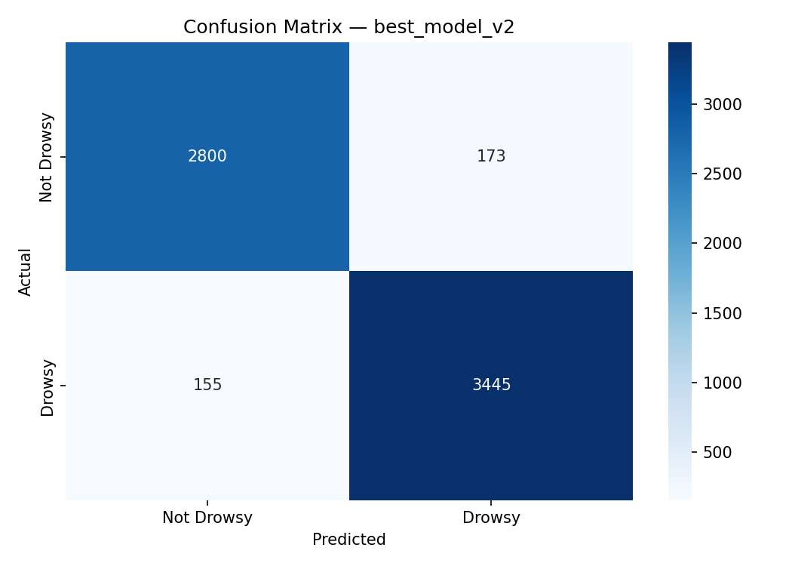
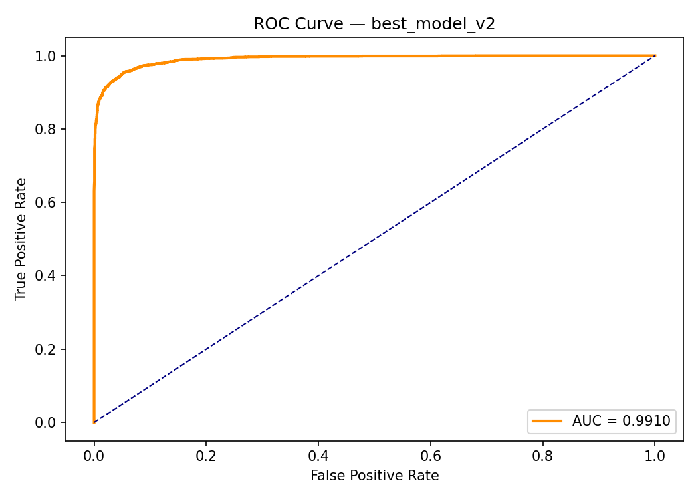
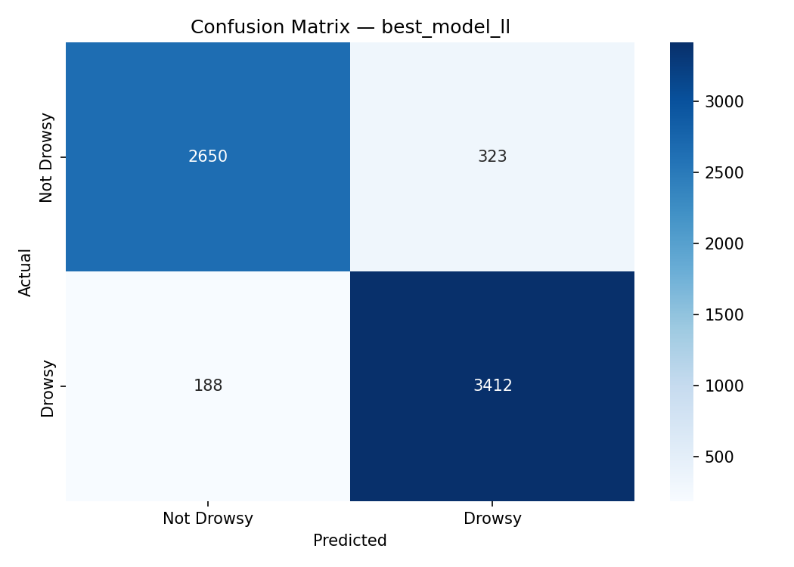
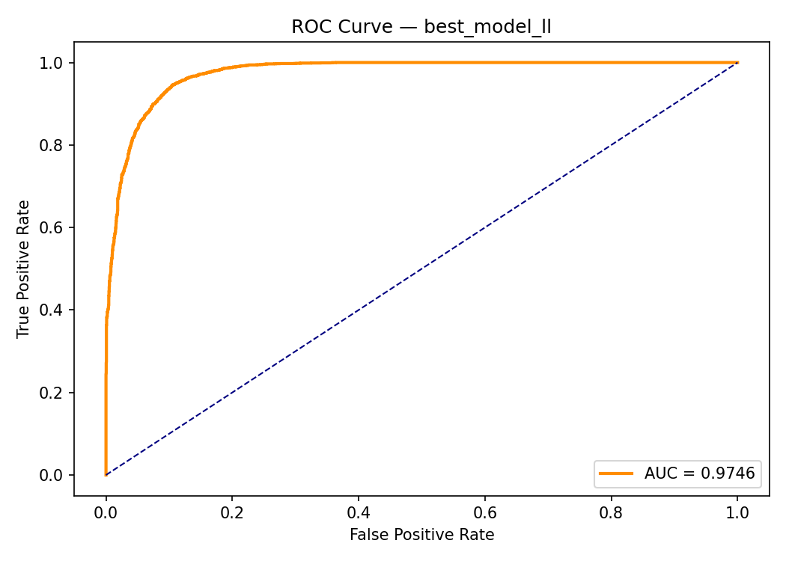

# Pilot Drowsiness Detection System

A real-time AI-based pilot/driver drowsiness detection system that uses webcam video streams to identify drowsiness, eye closure, and inattentive behavior. The system combines MediaPipe facial landmark tracking with CNN-LSTM models for temporal analysis and classification.

## Features

- Real-time drowsiness detection
- Eye closure and inattentiveness monitoring
- CNN-LSTM based classification
- MediaPipe face and eye landmark tracking
- Low-light optimized model
- Streamlit web interface

## Technology Stack

- Python
- PyTorch
- OpenCV
- MediaPipe
- Streamlit

---

## Project Structure

```text
pilot-drowsiness/
│
├── app.py
├── drowsy_detection.py
├── step1_recrop.py
├── step2_retrain.py
├── step1_recrop_lowlight.py
├── step2_finetune_ll.py
│
├── best_model_v2.pth
├── best_model_ll.pth
├── face_landmarker.task
│
├── requirements.txt
├── README.md
│
├── confusion_matrix_v2.png
├── roc_curve_v2.png
├── confusion_matrix_ll.png
├── roc_curve_ll.png
│
├── eval_results.py
└── eval_results1.py
```

---

## Installation

Clone the repository:

```bash
git clone https://github.com/NamanSaxena2029/Pilot-Drowsiness.git
cd Pilot-Drowsiness
```

Install dependencies:

```bash
pip install -r requirements.txt
```

Run the application:

```bash
streamlit run app.py
```

---

## Results

### Normal Lighting Conditions

| Metric | Value |
|----------|----------|
| Accuracy | 95% |
| Precision | 95% |
| Recall | 95% |
| F1 Score | 95% |

#### Classification Report

| Class | Precision | Recall | F1-Score |
|---------|---------|---------|---------|
| Not Drowsy | 0.95 | 0.94 | 0.94 |
| Drowsy | 0.95 | 0.96 | 0.95 |

#### Confusion Matrix



#### ROC Curve



---

### Low-Light Conditions

| Metric | Value |
|----------|----------|
| Accuracy | 92% |
| Precision | 92% |
| Recall | 92% |
| F1 Score | 92% |

#### Classification Report

| Class | Precision | Recall | F1-Score |
|---------|---------|---------|---------|
| Not Drowsy | 0.93 | 0.89 | 0.91 |
| Drowsy | 0.91 | 0.95 | 0.93 |

#### Confusion Matrix



#### ROC Curve



---

## Model Pipeline

1. Face detection using MediaPipe.
2. Eye region extraction and preprocessing.
3. Feature extraction using CNN.
4. Temporal sequence modeling using LSTM.
5. Classification into:
   - Drowsy
   - Not Drowsy

---

## Limitations

- Performance may degrade in extremely dark environments.
- Webcam quality affects detection accuracy.
- Occlusions such as sunglasses can impact landmark detection.

---

## Authors

**Naman Saxena**

**Nilesh Sahu**
